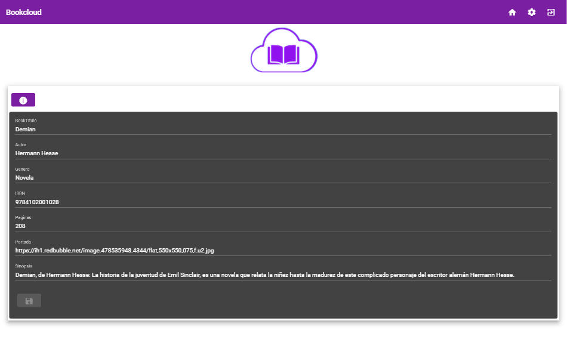

# BookCloud-Angular

# Introducción

BookCloud es una aplicación donde dejar críticas, puntuar libros que has leído y ver las críticas y puntuaciones de otros.

Consta de 2 partes, la Aplicación y una API que accede a la BBDD alojada en mLab

#

API – Tecnologías usadas

## MongoDB

Es un sistema de base de datos NoSQL orientado a documentos de código abierto.

En lugar de guardar los datos en tablas, tal y como se hace en las bases de datos relacionales, MongoDB guarda estructuras de datos BSON (una especificación similar a JSON) con un esquema dinámico, haciendo que la integración de los datos en ciertas aplicaciones sea más fácil y rápida.

##

Node.js

Es un entorno que trabaja en tiempo de ejecución, de código abierto, multi-plataforma, que permite a los desarrolladores crear toda clase de herramientas de lado servidor y aplicaciones en JavaScript.

La ejecución en tiempo real está pensada para usarse fuera del contexto de un explorador web (es decir, ejecutarse directamente en una computadora o sistema operativo de servidor). Como tal, el entorno omite las APIs de JavaScript específicas del explorador web y añade soporte para APIs de sistema operativo más tradicionales que incluyen HTTP y bibliotecas de sistemas de ficheros.

##

Express

Es el framework web más popular de Node, y es la librería subyacente para un gran número de otros frameworks web de Node populares.

A pesar de que Express es en sí mismo bastante minimalista, los desarrolladores han creado paquetes de middleware compatibles para abordar casi cualquier problema de desarrollo web. Hay librerías para trabajar con cookies, sesiones, inicios de sesión de usuario, parámetros URL, datos POST, cabeceras de seguridad y muchos más.

# API - Funcionamiento

## Conexión con base de datos

La API, a través del paquete **mongoose** accede a la base de datos alojada en **mLab**.

Consta de 3 colecciones **books** , **reviews** y **users.**

## Propiedades de los modelos

- Books
  - BookTitulo
  - BookSinopsis
  - BookISBN
  - BookPortada – URL de la portada
  - BookGenero
  - BookAutor
  - BookPaginas
  - updatedAt – Ultima vez modificado
  - reviews - Array de IDs de reviews

- Users
  - firstName
  - lastName
  - userName
  - createdDate – Fecha de creación
  - image –URL del avatar
  - status – Admin o no
  - hash – hash de la pass

- Reviews
  - Body – Cuerpo de la critica
  - Username – Usuario que ha hecho la critica
  - Book – Libro sobre el que se ha hecho al critica
  - Rating – Puntuación
  - UpdatedAt – Ultima vez modificada

## Llamadas a la API

La api puede recibir llamadas a 3 secciones, una por cada controlador de cada modelo, hay un requisito y es que las llamadas que no sean a authenticate o register de la sección de users deben tener adjuntas un Bearer Token, que puede obtenerse de la llamada Authenticate introduciendo un usuario valido, de lo contrario la API rechazara la llamada.

- **Users**
  - POST users/register – Registra un usuario
    - Con body:
    - {
    - &quot;firstName&quot;: &quot;nombre&quot;,
    - &quot;lastName&quot;: &quot;apellido&quot;,
    - &quot;username&quot;: &quot;nombre de usuario&quot;,
    - &quot;email&quot;: &quot;mail del usuario
    - &quot;password&quot;: &quot;contraseña&quot;
    - }
  - POST users/authenticate – Autentica un usuario y genera un token
    - Con body:
    - {
    - &quot;username&quot;: &quot;nombre de usuario&quot;,
    - &quot;password&quot;: &quot;contraseña&quot;
    - }
  - GET users/ - Obtiene todos los usuarios de la BD
  - GET users/current – Obtiene datos del usuario actual
  - GET users/[ID] – Obtiene datos de un usuario dada su ID
  - PUT users/[ID] – Actualiza los datos de un usuario dada su ID
  - DELETE users/[ID] – Borra un usuario dada su ID

- **Books**
  - POST /books – Crea un nuevo libro
    - Con body:
    - {
    - &quot;BookTitulo&quot;: &quot;titulo&quot;,
    - &quot;BookSinopsis&quot;: &quot;sinopsis&quot;,
    - &quot;BookISBN&quot;: &quot;isbn&quot;,
    - &quot;BookPortada&quot;: &quot;urlPortada&quot;,
    - &quot;BookGenero&quot;: &quot;genero&quot;,
    - &quot;BookAutor&quot;: &quot;autor&quot;,
    - &quot;BookPaginas&quot;: [Número de páginas]
    - }
  - GET /books – Obtiene todos los libros de la BD
  - GET /books/[ID] – Obtiene los datos de un libro dada su ID
  - PUT/books/[ID] – Actualiza los datos de un libro dada su ID
  - DELETE /books/[ID] – Borra un libro dada su ID
- **Reviews**
  - POST /reviews – Crea una review y almacena su id en el Array reviews dentro del books
    - Con body:
    - {
    - &quot;book&quot;: &quot;nombre del libro&quot;,
    - &quot;username&quot;: &quot;nombre del usuario&quot;,
    - &quot;body&quot;: &quot;cuerpo de la critica&quot;,
    - &quot;rating&quot;: &quot;puntuación&quot;
    - }
  - GET /reviews/[nombre del libro] – Obtiene todas la reviews de un libro dado su nombre

# Aplicación web – Tecnologías usadas

##

Angular 7

Es un framework para aplicaciones web desarrollado en TypeScript, de código abierto, mantenido por Google, que se utiliza para crear y mantener aplicaciones web de una sola página. Su objetivo es aumentar las aplicaciones basadas en navegador con capacidad de Modelo Vista Controlador (MVC), en un esfuerzo para hacer que el desarrollo y las pruebas sean más fáciles.

##

Material Design

Es una normativa de diseño enfocado en la visualización del sistema operativo Android, además en la web y en cualquier plataforma. Fue desarrollado por Google y anunciado en la conferencia Google I/O celebrada el 25 de junio de 2014. Ampliando la interfaz de tarjetas vista por primera vez en Google Now.

Google también lanzó APIs para que los desarrolladores externos incorporaran Material Design a sus aplicaciones.

# Aplicación web – Funcionamiento

## Mapa web

La web consta de 4 módulos visibles a usuarios sin status a las que se suman 3 que solo pueden ver usuarios con el status de admin.

## Páginas

### Login

### Register

### Books

### Admin-panel

### Book-add

### Books-detail

### Book-edit

